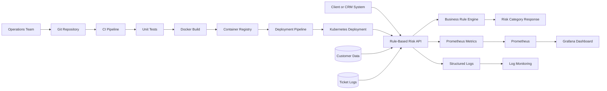

# DevOps Architecture

## Notes

- Churn logic is fully deterministic and stored as business rules.
- CI/CD validates code, builds the container image, and deploys the service.
- Monitoring focuses on API health, latency, request volume, and logs.

