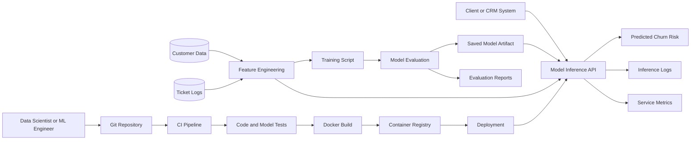

# ML Architecture

## Notes

- Rule logic is replaced by a trained classifier model.
- The system now depends on feature engineering, model training, and saved artifacts.
- Evaluation metrics such as F1, ROC-AUC, and Precision-Recall become mandatory.

