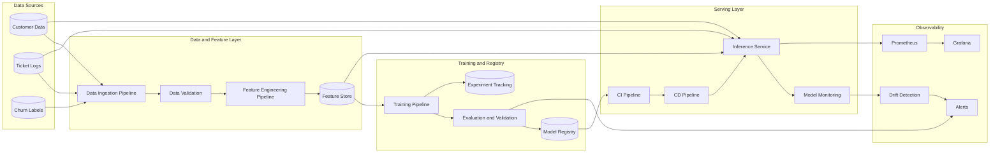

# MLOps Architecture

## Notes

- MLOps adds automated data validation, experiment tracking, model registry, and drift monitoring.
- Deployment decisions depend on both software quality and model quality gates.
- Monitoring extends beyond service uptime to data quality, prediction quality, and model decay.

